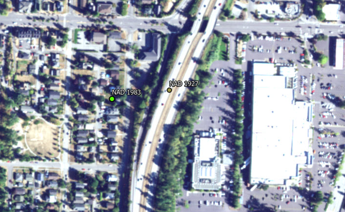

This is a great video to introduce the topic of datums and how they relate to coordinate reference systems. I recommend you watch it on your own.

[Coordinate System Jargon](https://www.youtube.com/watch?v=Z41Dt7_R180)

## Datums

So just what is a datum?

Remember that the earth is unevenly shaped.

A datum mathematically defines the shape and size of the earth and it's orientation in space.

Measurements of the surface of the earth in different places collected over time by surveyors are used to define a geodetic datum.

Shifts in the surface of the earth, such as following an  earthquake like occurred in New Zealand in 2011, mean that new measurements have to be taken. [Tectonic geodesy](https://geo.libretexts.org/Bookshelves/Seismology/Book%3A_Living_With_Earthquakes_in_The_Pacific_Northwest_(Yeats)/02%3A_Part_II-_Tectonic_Plates_Geologic_Time_and_Earthquakes/2.05%3A_Earthquake_Basics) compares surveys done at different times to measure elevation changes before and after earthquakes that cause deformations in the earth's crust.

<figure>
  
  <figcaption><a href="https://www.zimbio.com/photos/Tristan+Webb/cVE-Fs1_NsT/Celebrity%20News">Rupture along River Road in Christchurch, NZ as a result of February 2011 earthquake.</a> Source: Martin Hunter/Getty Images AsiaPac.</figcaption>
</figure>

&nbsp;

Another way to think about datums is that they are a reference for a starting point against which to determine other horizontal or vertical measurements.

For example, a datum ensures that engineers, surveyors, planners, and mapmakers are all starting at the same “zero” elevation.

<figure>
  
  <figcaption><a href="https://www.nrcan.gc.ca/maps-tools-publications/maps/100-years-geodetic-surveys-canada/9110">First precise vertical survey in 1883 along the Richelieu and St. Lawrence Rivers,</a> Government of Canada.</figcaption>
</figure>

&nbsp;

### Horizontal and Vertical Datums

A **horizontal** datum measures positions on the surface of the Earth using latitude and longitude.

> A horizontal datum is used to monitor the movement of the Earth's crust, or in other words, to monitor earthquake activity.

> Horizontal datums are also used with geospatial data. All geospatial data should have a defined horizontal datum.

A **vertical** datum defines the height either above or below a nationally defined reference surface (e.g., mean sea level).

> Not all geospatial data needs to have a defined vertical datum, but it makes sense if you are using elevation data in a GIS.

> There was just a new [vertical datum](https://www2.gov.bc.ca/gov/content/data/geographic-data-services/georeferencing/vertical-reference-system) released last year for BC, important for any sea level rise mapping and accuracy.

### A Brief History of Datums

This history varies according to country.

Although Canada and the U.S.A. have different surveying histories, they have used the same datum since 1913 because they are on the same continent, along with Mexico.

In 1901, the Meades Ranch triangulation station in Kansas (established in 1891) was chosen as the point relative to which all land measurements in the United States were made, in part of because of its geographic centrality to the nation.

<figure>
  
  <figcaption><a href="https://gisgeography.com/wp-content/uploads/2015/09/image1.jpg">Meades Ranch Triangulation Station. </a> <a href="https://gisgeography.com/geodetic-datums-nad27-nad83-wgs84/"> GISGeography. </a> </figcaption>
</figure>

&nbsp;

In 1913, both Canada and Mexico decided to adopt this station as the starting point as well.

As a result, the name of the datum was changed.

Who can guess what that datum and subsequent datums became called?

North American Datum 1913, North American Datum 1927, and so on.

 

Below is a breakdown of the differences between datums currently in use.

### North American Datum 1927

- uses the Clarke Ellipsoid of 1866
- reference point at Meade’s Ranch, Kansas
- many control points calculated from observations in the 1800s
- developed using 26,000 stations

<figure>
  
  <figcaption> </a>  Survey monument on Flora Peak in Chilliwack Lake Provincial Park. Photo: Maya Daurio</a> </figcaption>
</figure>

&nbsp;

### North American Datum 1983

- uses the the Geodetic Reference System (GRS80)
- uses the Earth's center as the reference point rather than a ranch in Kansas
- based on both ground measurements and satellite information
- developed using 250,000 stations
- from 1986 to 2011, this datum has been adjusted four times

### World Geodetic System of 1984 (WGS 1984)

-  developed by U.S. Department of Defense using Doppler observations from the Navy Navigation Satellite System (NNSS)
- assumed to be identical to original NAD 83 in conterminous U.S.
- later iterations in 1996 and 2002 based entirely on GPS observations
- used by military and GPS systems

### Another datum coming down the pike (2022)

- the National Geodetic Survey in the U.S. is currently working on a new datum
- will rely on Global Navigation Satellite Systems (GNSS) and Global Positioning Systems (GPS)
- will use an updated geoid (hypothetical mean sea level) model

### Why Should You Care?

- for starters, you will inevitably encounter errors working with GIS data, and understanding datums and coordinate systems can help you troubleshoot those errors
- coordinates change depending on the datum and spheroid on which they're based, even if they are using the same map projection

For example, the geographic coordinates below are for a single point located within the city of Bellingham, Washington, using 3 different datums:

| DATUM  | X-Coordinate | Y-Coordinate |
| ------------- | ------------- |
| NAD_1927  | -122.466903686523 | 48.7440490722656 |
| NAD_1983  | -122.46818353793 | 48.7438798543649 |
| WGS_1984 | -122.46818353793 | 48.7438798534299 |

<figure>
  
  <figcaption> </a>  Offset between two points in Bellingham in NAD 1927 and NAD 1983, respectively. The point using coordinates from the WGS 1984 datum is projected on the fly and corresponds to the NAD 1983 point. Photo: Maya Daurio</a> </figcaption>
</figure>

&nbsp;

While it is unlikely you'll ever encounter data registered to NAD 1913, there are still data you may encounter in NAD 1927, especially if you're working with survey control data.

In the next section, we'll explore two different kinds of coordinate systems that are used in map making, geographic and projected coordinate systems.

To learn more about Canada's unique history of surveying, check out [100 Years of Geodetic Surveys in Canada](https://www.nrcan.gc.ca/earth-sciences/geomatics/canadian-spatial-reference-system-csrs/100-years-geodetic-surveys-canada/9110).

This section references information and ideas from [What is a datum](https://oceanservice.noaa.gov/facts/datum.html), [NOAA Celebrates 200 Years](https://celebrating200years.noaa.gov/magazine/vertical_datums/welcome.html#network), [Geodetic Datums](https://gisgeography.com/geodetic-datums-nad27-nad83-wgs84/), and  [100 Years of Geodetic Surveys in Canada](https://www.nrcan.gc.ca/earth-sciences/geomatics/canadian-spatial-reference-system-csrs/100-years-geodetic-surveys-canada/9110), and [FAQ: Projection Basics](https://support.esri.com/en/technical-article/000005562).
