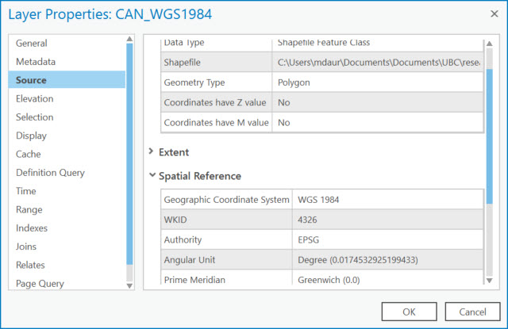

## Exercise 1: What coordinate system is my data in?

*1*{: .circle .circle-blue} From the folder where you downloaded and extracted the workshop data, open the **WGS1984** MXD (map).

In ArcGIS Pro, each map is automatically loaded with a default topographic basemap, which takes on the coordinate system of the first dataset added to the map.

*2*{: .circle .circle-blue} Turn on the layer in your map by checking the box next to it in the **Contents**. If there is a red exclamation point next to your dataset and nothing in the map, double-click on the shapefile in the Table of Contents.

*3*{: .circle .circle-blue} Under the **Source** tab, click on **Set Data Source**.

*4*{: .circle .circle-blue} Navigate to the **shapefiles** folder you downloaded and select **CAN_WGS1984.shp** and click **OK**.

### Metadata

Notice the units in the lower centre of the screen, below the map.

These give you a clue as to whether this data is in a geographic or projected coordinate system.

Let's look at the properties, or metadata, of the dataset.

**Metadata** is data about data.

*5*{: .circle .circle-blue} Right-click the data in the Contents pane and select **Properties**.

*6*{: .circle .circle-blue} Under the **Source** tab, expand the **Spatial Reference** section and note what is listed for **Geographic Coordinate System** and **Angular Unit**.

In the next exercise we'll go over projection on-the-fly.
