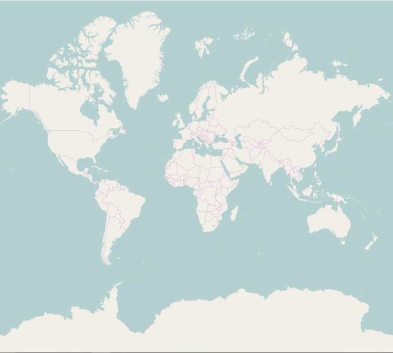
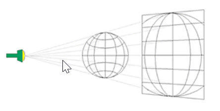
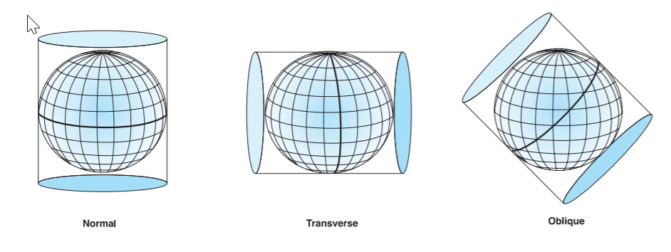
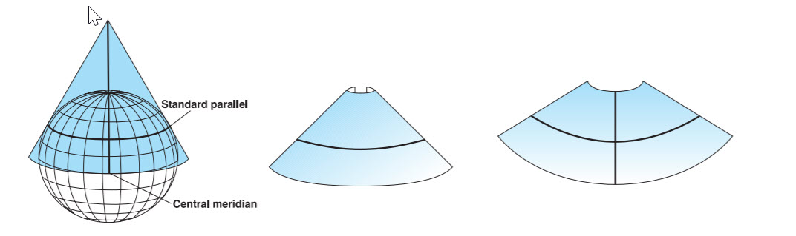

## Map Projections

Let's revisit the main takeaways about projections that we learned from the video at the beginning of class.

See if you can answer the questions below before you reveal the correct answer by clicking on the arrow.

A projection is a mathematical equation to flatten data from a 3D surface onto a ____ plane. 

2D.

 

All projections accurately represent the sizes of the continents. True or false. 

False. Every projection is distorted in some way, and some distort the sizes of different land masses a lot.

 

Who can identify the projection below and which properties it preserves and distorts?

The Mercator projection preserves direction and shape. In web maps, it's also good for generating map tiles because it projects the world into a square evenly subdivided across zoom levels, and 90 degree turns appear as right angles. The Mercator projection distorts size, or area. Notice the classic example of comparing the size of Greenland to the continent of Africa in this map.

 

<figure>
  
  <figcaption><a href="https://commons.wikimedia.org/wiki/File:WebMercator.png">Which projection am I?</a> (c) <a href="https://commons.wikimedia.org/wiki/User:TheCrazyWhovian">TheCrazyWhovian</a> <a href="https://creativecommons.org/licenses/by-sa/4.0/deed.en">, CC BY-SA 4.0. </a></figcaption>
</figure>

&nbsp;

### Terminology

Remember latitude and longitude? In the context of projections, it may be useful to think of these as lines that have another name to describe them.

Lines of latitude are also called parallels and run east-west parallel to the equator.

Lines of longitude are called meridians and run north-south between the North and South Poles.

<figure>
  
  <figcaption><a href="https://kartoweb.itc.nl/geometrics/Map%20projections/Understanding%20Map%20Projections.pdf">Parallels and meridians form a graticule.</a> Melita Kennedy, Esri.</figcaption>
</figure>

&nbsp;

Map projections are typically categorized into three different types, based on the visualization of light shining through through the earth onto a surface, where the surface is a plane, a cylinder, or a cone, respectively.

<figure>
  
  <figcaption><a href="http://www.geo.hunter.cuny.edu/~jochen/gtech201/lectures/lec6concepts/10%20-%20Types%20of%20map%20projections.html">The concept of projection illustrated by shining a light through the earth's surface and projecting it onto a two-dimensional surface, like a map. </a> Types of Map Projections, <a href="http://www.geography.hunter.cuny.edu/~jochen/"> Jochen Albrecht.</a></figcaption>
</figure>

&nbsp;

There are also those who [recommend](https://en.wikipedia.org/wiki/Map_projection#Projections_by_surface) dispensing with the three projection categories because they don't account for all projections and can lead to misunderstanding and confusion.

Nevertheless, these three categories can be useful models for illustrating some map projections.

Projections based on each surface can be used for mapping particular parts of the world.

Where each respective surface touches the earth is also the area of the world portrayed most accurately using one of the three surfaces described below.

### Planar/Azimuthal Projections

<figure>
  
  <figcaption><a href="https://kartoweb.itc.nl/geometrics/Map%20projections/Understanding%20Map%20Projections.pdf">Possible aspects of planar projections.</a> Melita Kennedy, Esri.</figcaption>
</figure>

&nbsp;

- area and shape distortion are circular around the point of contact, so these projections accommodate circular regions better than rectangular regions
- point of contact can be anywhere on earth's surface but north and south poles most common point of contact
- longitude lines converge at the north pole and radiate outward
- latitude lines appear as a series of concentric circles
- distances from or through the map center are true
- directions from the map center to any other point are also held true
- any other measure of distance or direction will not be true
- not good for world maps because only show about half of earth at a time

<figure>
  
  <figcaption><a href="https://faculty.kutztown.edu/courtney/blackboard/Physical/05Project/aziproj.html">Example of an azimuthal projection in the polar region. </a>Map Projections, <a href="https://faculty.kutztown.edu/courtney/"> Richard S. Courtney.</a></figcaption>
</figure>

&nbsp;

### Cylindrical Projections

<figure>
  
  <figcaption><a href="https://kartoweb.itc.nl/geometrics/Map%20projections/Understanding%20Map%20Projections.pdf">Possible aspects of cylindrical projections.</a> Melita Kennedy, Esri.</figcaption>
</figure>

&nbsp;

- Mercator projection is a cylindrical projection with line of tangency at equator
- produce maps with straight, evenly-spaced meridians and straight parallels that intersect meridians at right angles
- touch the globe along a line rather than a point, as with planar
- display true direction along straight lines
- a cylinder wrapped around a globe will cover more of the globe than either a plane or cone can
- tend to be better for world maps but still can't show All of earth's surface

<figure>
  
  <figcaption><a href="https://faculty.kutztown.edu/courtney/blackboard/Physical/05Project/cylproj.html">Example of an cylindrical projection where the axis of the cylinder coincides with the Earth's axis of rotation. </a>Map Projections,<a href="https://faculty.kutztown.edu/courtney/"> Richard S. Courtney.</a></figcaption>
</figure>

&nbsp;

### Conical Projections

<figure>
  
  <figcaption><a href="https://kartoweb.itc.nl/geometrics/Map%20projections/Understanding%20Map%20Projections.pdf">A representation of the simplest conic projection tangent to the globe along a line of latitude called the standard parallel.</a> Melita Kennedy, Esri.</figcaption>
</figure>

&nbsp;

- used for midlatitude zones that have an east-to-west orientation (because cone wider than it is tall)
- single cone cannot show the whole globe
- conic maps show only a sector of a complete circle…they don't develop into a complete circle
- produce maps with straight converging longitude lines and concentric circular arcs for latitude lines
- simplest conic projection contacts the globe along a single latitude line, a tangent, called the standard parallel
- distortion increases north and south of the standard parallel

<figure>
  
  <figcaption><a href="https://faculty.kutztown.edu/courtney/blackboard/Physical/05Project/conproj.html">Example of a conic projection in the mid-latitude region. </a>Map Projections, <a href="https://faculty.kutztown.edu/courtney/"> Richard S. Courtney.</a></figcaption>
</figure>

&nbsp;

In the next section, we'll go over choosing the right projection for your data.

This section uses ideas and images from [Wikipedia](https://en.wikipedia.org/wiki/Map_projection#Projections_by_surface), [Projected Coordinate Systems](https://mgimond.github.io/Spatial/chp09-0.html#projected-coordinate-systems), [Understanding Map Projections](https://kartoweb.itc.nl/geometrics/Map%20projections/Understanding%20Map%20Projections.pdf), [Light Source Metaphor](https://www.mdpi.com/2220-9964/8/4/162/pdf), and [361 Lectures](http://www.geography.hunter.cuny.edu/~jochen/GTECH361/lectures/), and [Map Projections](https://faculty.kutztown.edu/courtney/blackboard/Physical/05Project/project.html).
